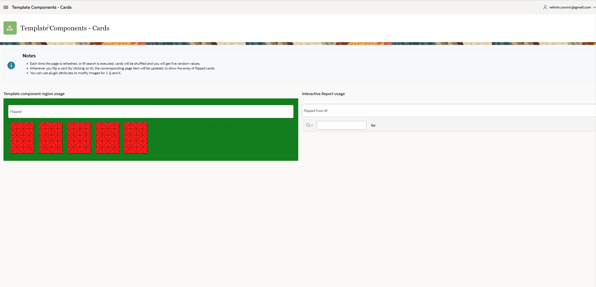

# Oracle APEX Playing Cards Template Component

This plugin enables visualization of playing cards, with built-in support for card flipping and customizing card images.


## Preview



## Installation

Import the template_component_plugin_dev_velimir_playing_card.sql file into your application.


## Usage

The plugin can be used either within standard regions or within Interactive reports.


## Plugin Attributes

| Name                                    | Description                                                                                                                                                                                                             |
|-----------------------------------------|------------------------------------------------------------------------------------------------------------------------------------------------------------------------------------------------------------------------ |
| Suit                                    | Column within the corresponding query that will return SUIT value. Valid values for data with this column are: 'diams', 'clubs', 'hearts' and 'spades'.                                                                 |
| Value                                   | Column within the corresponding query that will return numeric VALUE. Valid values for data with this column are numbers from 1 to 14, excluding number 11.                                                             |
| Item to hold the array of flipped cards | Page item that will hold the array of flipped cards. Each element of the array will contain the flipped card suit and value, and if cards are not part of the IR, it will contain the flipped card order number as well.|
| Static file to hold the Jack image      | Path to the static file containing the card image for Jack. If not provided, the generic letter J will be shown.                                                                                                        |
| Static file to hold the Queen image     | Path to the static file containing the card image for Jack. If not provided, the generic letter Q will be shown.                                                                                                        |
| Static file to hold the King image      | Path to the static file containing the card image for Jack. If not provided, the generic letter K will be shown.                                                                                                        |


## Demo Application

You can find a Demo Application [here](https://apex.oracle.com/pls/apex/r/velimir_ws/template-components-cards).


## Sample SQL (five shuffled cards)

```
with card_num as (select rownum cn
                 from dual
                 connect by rownum <= 14),
      card_sgn as (select decode(rownum,1,'diams',2,'clubs',3,'hearts',4,'spades') cs
                 from dual
                 connect by rownum <= 4)
       select t.card_number as VALUE,
              t.card_suit as SUIT from 
            (select card_num.cn as card_number, 
                    card_sgn.cs card_suit 
             from card_num, card_sgn
             where card_num.cn != 11
             order by dbms_random.normal) t             
       where rownum <= 1 * 5;
```
